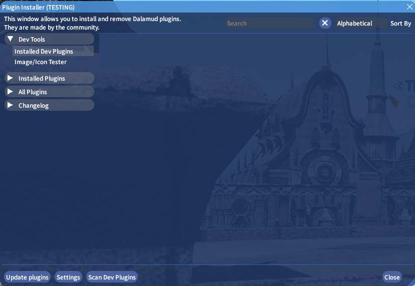
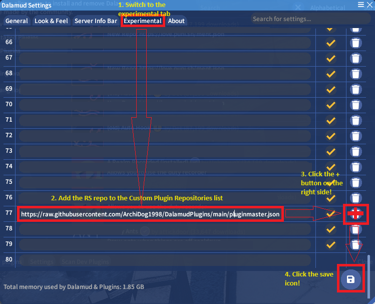
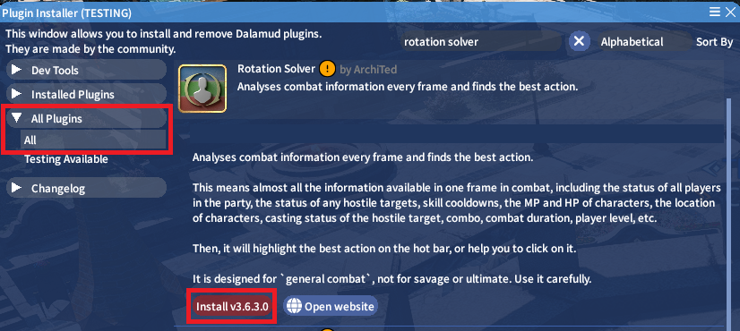
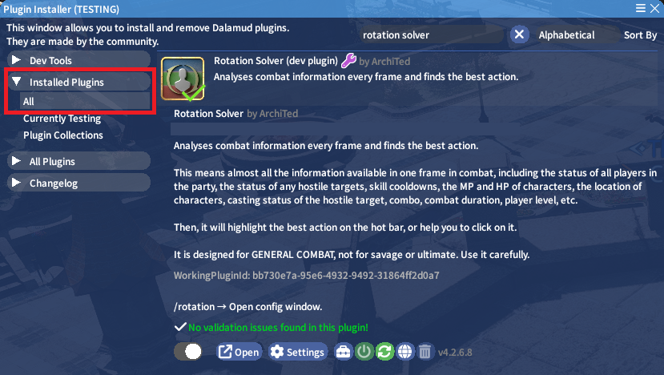

# Start Up

## Installation

Open the Dalamud Plugin installer window using either the /xlplugins command or by clicking the Dalamud Plugins button in the system menu.

Open the Settings window, go to the Experimental tab and add https://raw.githubusercontent.com/ArchiDog1998/DalamudPlugins/main/pluginmaster.json to the list.

Don't forget to push the save button!

After doing that you should find Rotation Solver in the initial Plugin installer addon list under all plugins. Just click Install vXXXXX and it's done!

After that you should find it under the Installed Plugins list if it installed correctly.

## Activation

To activate Rotation Solver is really easy, you just need to bind to macros the basic commands:

/rotation auto

or

/rotation manual

And to stop Rotation solver you need to assign

## To turn it on

After enabling the `Rotation Solver`, Enter `/rotation auto` in the chat window.

That's all.

# Statement

## Basic Info

This plugin has been developing since 2022 and is ArchiTed's little (maybe not so little now) fun project. It all started as a plan to help people who are not great at doing their rotations enjoy the game while not being a liability to their parties or other players.

Being Archi's little project, he also uses this to learn new coding stuff so that it might break from time to time, but it's always fixed as soon as possible, and when that happens it's always back and better than before!

This plugin is not intended to be a bot or to farm stuff while you are not playing. It helps you but it doesn't replace human involvement. Please respect the purpose that it was made for.

## Compatibility

| Name                   | Icon                                                         | Issue                                                       |
| ---------------------- | ------------------------------------------------------------ | ----------------------------------------------------------- |
| Boss Mod (Reborn)      |  | Skill usage issues with the auto rotation part of the addon |
| Redirect               |  | Skill targetting issues                                     |
| Reaction               |                                                              | May cause issues with skill queueing settings               |
| Simple Tweaks          |  | Blocks targeting treasure hunt enemies                      |
| Rotation Solver Reborn |  | Just no.                                                    |
| MMOMinion              |  | Probably your computer will explode                         |
| Reborn Buddy           |  | Probably burn your computer                                 |

Not limited to these addons, generally anything that interacts with targetting or skill usage.

## Personal thoughts

ArchiTed is not good at playing the MMORPGs like FF14. And ArchiTed loves the simulation strategy games more. So the Rotation Solver turns the FF14 into a strategy game. 

So ArchiTed enjoys developing Rotation Solver more than playing FF14.

And the point is: Please don't ask ArchiTed to do anything about fixing rotations or adding new features. 

Caaaaat was right, Rotation Solver is ArchiTed's plugin.

# UI Description

The whole UI stuff was created based on the Repo [XIVConfigUI](https://github.com/ArchiDog1998/XIVConfigUI). If you love this UI style, you can try to use it in your project!

<!--An overview window needed-->

## Switch Panel

 You can click the panel on the left side, to switch between windows.

## Config Types

Almost all configs can be changed by the macro. So you can add any settings to your macro or qolbar to make it easy to change during combat, if it is necessary.

