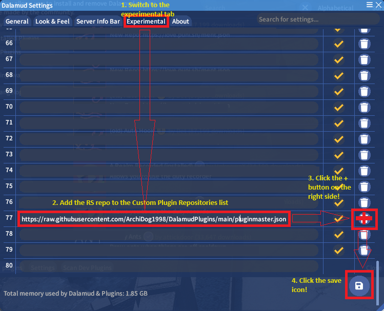
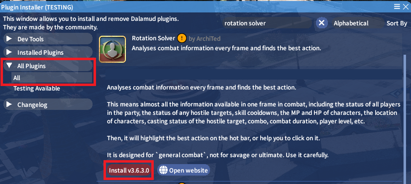
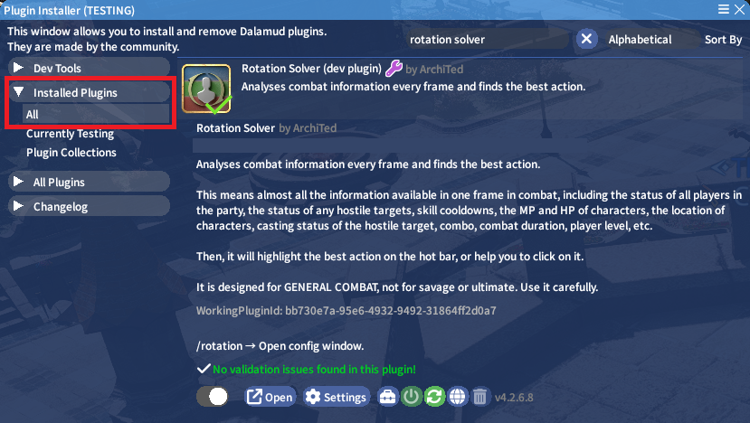

# Start Up

## Installation
Open the Dalamud Plugin installer window using either the /xlplugins command or by clicking the Dalamud Plugins button in the system menu.

Open the Settings window, go to the Experimental tab and add https://raw.githubusercontent.com/ArchiDog1998/DalamudPlugins/main/pluginmaster.json to the list.\

Don't forget to push the save button!
After doing that you should find Rotation Solver in the initial Plugin installer addon list under all plugins. Just click Install vXXXXX and it's done!

After that you should find it under the Installed Plugins list if it installed correctly.

## Activation

To activate Rotation Solver is really easy, you just need to bind to macros the basic commands:

/rotation auto

or

/rotation manual

And to stop Rotation solver you need to assign

/rotation cancel

